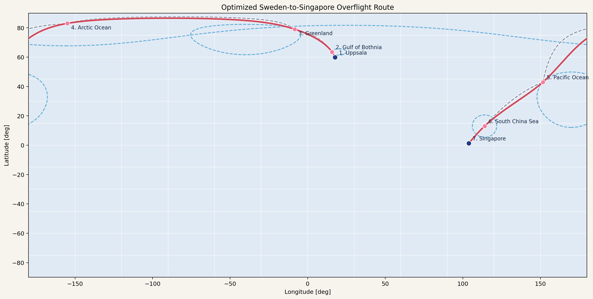
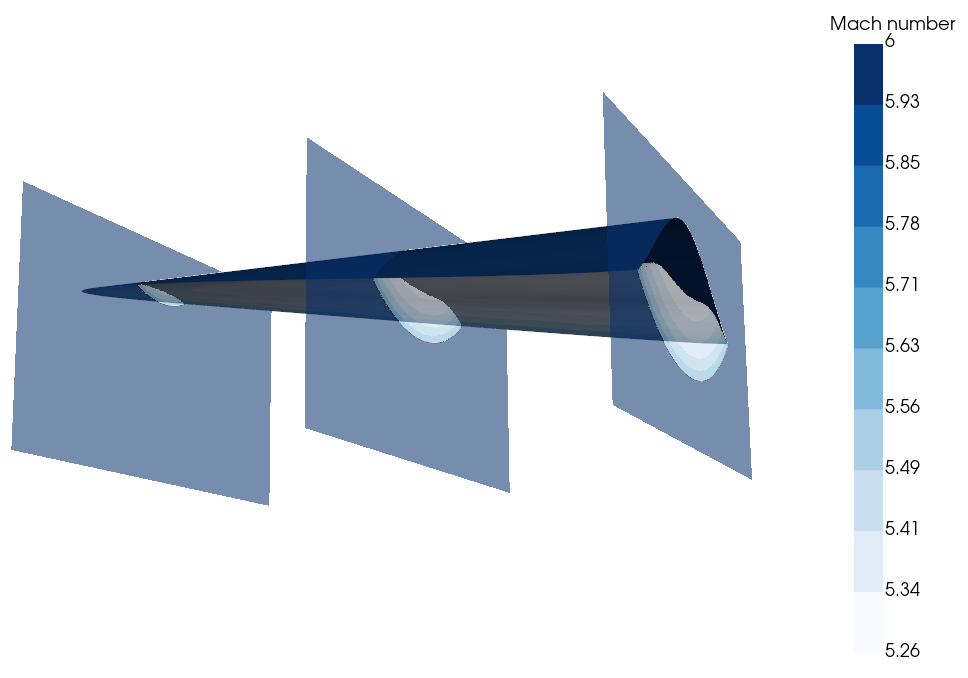
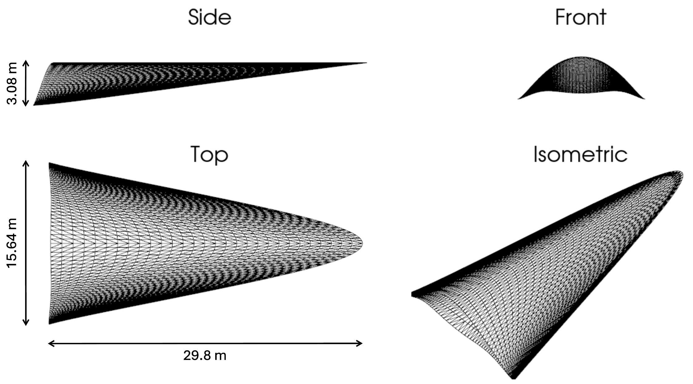

# Hypersonic Waverider

A Python toolkit for designing, analyzing, and optimizing **hypersonic cone-derived waverider** geometries for hypersonic cruise from Uppsala to Singapore. Built as a course project for MIT 16.122 (Hypersonic Aerothermodynamics); a fork of [https://github.com/ExusiaiVAL/Waverider-Generator](ExusiaiVAL/Waverider-Generator).

A full description of the waverider generation method, aerothermodynamics modeling, references, and results is provided in [doc/doc.pdf](doc/doc.pdf).






## Objectives
- Generate waverider geometries from a small set of trailing-edge shape parameters.
- Predict inviscid and viscous aerodynamic performance (lift, drag, L/D) at hypersonic conditions.
- Estimate aerothermal loads and required leading-edge bluntness for a chosen material limit.
- Optimize the shape parameters to maximize L/D (or thrust-to-weight) subject to geometric constraints.

## Physics
The design pipeline combines several classical hypersonic methods:
- **Taylor–Maccoll flow.** The flow over a right circular cone at zero incidence is solved to obtain the post-shock conical flowfield used as the parent flow.
- **Cone construction.** A user-specified trailing-edge curve in the base plane is swept upstream along streamlines of the parent conical flow. The resulting lower surface rides exactly on the conical shock, so the bow shock is attached at every leading-edge point ("waveriding"). The upper surface is built as a freestream surface.
- **Oblique-shock and Prandtl–Meyer relations** set the surface pressures used for inviscid force integration.
- **Compressible laminar boundary layer.** A reference-temperature method with Eckert's enthalpy correction is integrated along each streamline to obtain skin friction, momentum thickness, and wall heat flux.
- **Leading-edge blunting.** Stagnation-point heating (Fay–Riddell-style) is balanced against radiative cooling at a user-specified material temperature limit to size the leading-edge radius; the associated wave-drag penalty is added back into the force accounting.
- **Optimization.** A differential-evolution search over the trailing-edge shape parameters (`R1_frac`, `W2_frac`, `n_shape`, `beta`) maximizes L/D under minimum volume / area / height constraints.


## Installation
```bash
pip install -r requirements.txt
```

## Running the demos
All demos are run from the `src/` directory and write figures into `runs/`.


### `demo.py` — analyze a single baseline waverider

Builds one of three preset waveriders (inviscid-L/D-optimal, viscous-L/D-optimal, or thrust-to-weight-optimal), runs the full aerothermodynamic analysis, writes plots to `runs/demo/`, and pops up an interactive 3D view. Edit the `wv = ...` line in the script to pick which preset to run.

```bash
python demo.py
```

### `demo_geometry.py` — sweep over shape parameters

Builds a grid of waveriders with varying `R1_frac`, `W2_frac`, and `n_shape`, runs inviscid aerodynamics on each, and saves a wireframe comparison plot to `runs/te_sweep/geometry_grid.png`. Useful for getting a feel for how the trailing-edge parameters deform the geometry.

```bash
python demo_geometry.py
```

### `demo_optimizer.py` — optimize for L/D or thrust-to-weight

Runs differential evolution over the trailing-edge shape parameters at fixed freestream conditions (M=6, 20 km standard atmosphere) and a 2500 K material limit. Set `optimizeThrust=True` to minimize `volume / (L/D)` instead of maximizing L/D, and `viscous=True/False` to include or exclude skin friction in the objective. Results are written to `runs/optimized2/`.

```bash
python demo_optimizer.py
```
